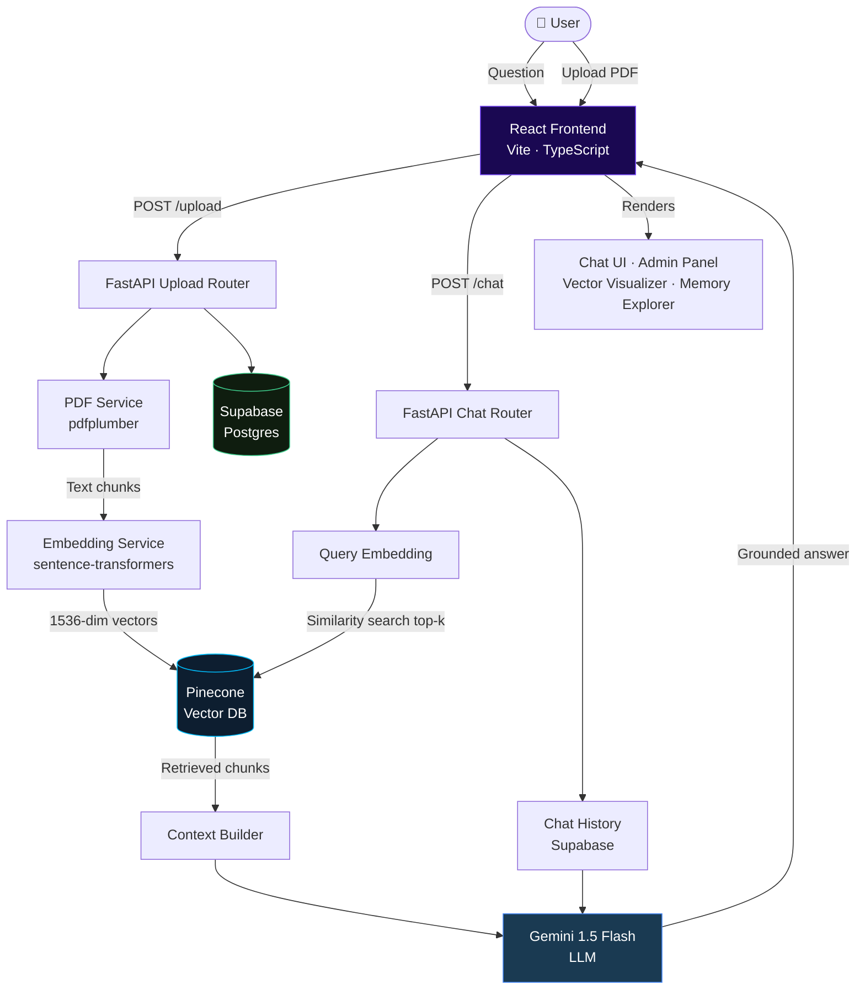

<div align="center">

# 🧠 ContextFlow RAG

### AI-Powered Retrieval-Augmented Generation Chatbot Platform

[](https://react.dev)
[](https://www.typescriptlang.org)
[](https://fastapi.tiangolo.com)
[](https://pinecone.io)
[](https://deepmind.google/gemini)
[](LICENSE)

**ContextFlow RAG** is a full-stack, production-ready chatbot platform that lets you upload PDF documents and instantly ask natural-language questions against them using **vector semantic search**, **RAG pipelines**, and **LLM-powered answers** — all with a stunning dark-mode UI.

[🚀 Quick Start](#-quick-start) · [🏗️ Architecture](#️-project-architecture) · [✨ Features](#-features) · [📸 Screenshots](#-screenshots) · [🔌 API Reference](#-api-reference)

</div>

---

## ✨ Features

| Feature | Description |
|---|---|
| **Multi-PDF Upload** | Drag-and-drop or browse to select multiple PDFs simultaneously with per-file progress tracking |
| **Vector Semantic Search** | Text chunks embedded into 1536-dim vectors and indexed in Pinecone for similarity retrieval |
| **RAG Chat** | Retrieval-Augmented Generation — context injected into Gemini LLM for grounded, accurate answers |
| **Cross-Document Search** | Query across all uploaded documents in a single conversation |
| **3D Vector Visualizer** | Interactive 3D scatter plot of your document embeddings in latent space |
| **Cognitive Memory** | Key-value store that persists user preferences and context across sessions |
| **Conversation History** | Multi-session chat with Supabase-persisted conversation logs |
| **Admin Panel** | Full document management: upload, re-index, delete, and search your knowledge base |
| **Friendly Error Messages** | Inline validation for invalid files, upload failures, network errors, and empty queries |
| **Premium Dark UI** | Glassmorphism, animated toasts, confetti, micro-animations throughout |

---

## 🏗️ Project Architecture



### Directory Structure

```
RAG/
├── backend/                    # FastAPI Python backend
│   ├── app/
│   │   ├── main.py             # App factory + CORS middleware
│   │   ├── routers/
│   │   │   ├── documents.py    # POST /upload, POST /upload-multiple
│   │   │   └── chat.py         # POST /chat (RAG pipeline)
│   │   └── services/
│   │       ├── pdf_service.py       # PDF extraction + chunking + embeddings
│   │       ├── pinecone_service.py  # Vector upsert + similarity search
│   │       ├── gemini_service.py    # LLM answer generation
│   │       └── supabase_service.py  # Chat history persistence
│   ├── uploads/                # Saved PDF files
│   ├── .env                    # API keys (not committed)
│   └── requirements.txt
│
├── src/                        # React TypeScript frontend
│   ├── components/
│   │   ├── ChatWindow.tsx      # Chat interface with error bubbles
│   │   ├── FileUploadZone.tsx  # Multi-PDF uploader with progress queue
│   │   ├── ChunkVisualizer.tsx # 3D vector scatter plot
│   │   ├── Layout.tsx          # App shell + navigation
│   │   ├── MemoryExplorer.tsx  # Memory key-value manager
│   │   └── Toast.tsx           # Animated toast notifications
│   ├── pages/
│   │   ├── LandingPage.tsx     # Marketing landing page
│   │   ├── ChatPage.tsx        # Multi-session RAG chat
│   │   └── AdminPage.tsx       # Document hub + vector explorer
│   ├── services/
│   │   ├── mockAiService.ts    # Backend API calls + error classification
│   │   └── mockStorage.ts      # localStorage state management
│   └── App.tsx                 # Router + ToastContainer root
│
├── index.html
├── vite.config.ts
├── package.json
└── README.md
```

---

## 🛠️ Tech Stack

### Frontend
| Technology | Version | Purpose |
|---|---|---|
| [React](https://react.dev) | 19 | UI framework |
| [TypeScript](https://typescriptlang.org) | 5.x | Type safety |
| [Vite](https://vitejs.dev) | 8 | Build tool & dev server |
| [Tailwind CSS](https://tailwindcss.com) | 4.x | Utility-first styling |
| [Framer Motion](https://framer.motion.com) | 12 | Animations & transitions |
| [Lucide React](https://lucide.dev) | 1.x | Icon library |
| [canvas-confetti](https://npmjs.com/package/canvas-confetti) | 1.x | Upload success celebration |
| [React Router](https://reactrouter.com) | 7 | Client-side routing |

### Backend
| Technology | Version | Purpose |
|---|---|---|
| [FastAPI](https://fastapi.tiangolo.com) | 0.1 | REST API framework |
| [Python](https://python.org) | 3.10+ | Backend language |
| [pdfplumber](https://github.com/jsvine/pdfplumber) | Latest | PDF text extraction |
| [sentence-transformers](https://sbert.net) | Latest | Local embedding model |
| [uvicorn](https://uvicorn.org) | Latest | ASGI server |

### AI & Data Services
| Service | Purpose |
|---|---|
| [Google Gemini 1.5 Flash](https://deepmind.google/gemini) | LLM for answer generation |
| [Pinecone](https://pinecone.io) | Managed vector database |
| [Supabase](https://supabase.com) | Chat history & user storage |

---

## 🚀 Quick Start

### Prerequisites

- **Node.js** ≥ 18 and **npm** ≥ 9
- **Python** ≥ 3.10
- A [Pinecone](https://pinecone.io) account with a new index (dimension: `384`, metric: `cosine`)
- A [Supabase](https://supabase.com) project with a `chat_history` table
- A [Google AI Studio](https://aistudio.google.com) API key for Gemini

---

### 1. Clone the Repository

```bash
git clone https://github.com/your-username/contextflow-rag.git
cd contextflow-rag
```

---

### 2. Configure the Backend

```bash
cd backend
cp .env.example .env
```

Edit `backend/.env` and fill in your credentials:

```dotenv
# Google Gemini AI
GEMINI_API_KEY=your_gemini_api_key_here

# Pinecone Vector Database
PINECONE_API_KEY=your_pinecone_api_key_here
PINECONE_INDEX_NAME=your_index_name
PINECONE_ENVIRONMENT=your_pinecone_environment

# Supabase
SUPABASE_URL=https://your-project.supabase.co
SUPABASE_KEY=your_supabase_anon_key_here
```

---

### 3. Start the Backend Server

```bash
# Create and activate a virtual environment
python -m venv venv
venv\Scripts\activate        # Windows
# source venv/bin/activate   # macOS/Linux

# Install dependencies
pip install -r requirements.txt

# Start the FastAPI dev server
uvicorn app.main:app --reload --host 0.0.0.0 --port 8000
```

The API will be available at **http://localhost:8000**  
Interactive docs at **http://localhost:8000/docs**

---

### 4. Start the Frontend

Open a new terminal:

```bash
# From the project root
npm install
npm run dev
```

The app will be available at **http://localhost:5173**

---

### 5. Supabase Table Setup

Run this SQL in your Supabase SQL editor to create the chat history table:

```sql
CREATE TABLE IF NOT EXISTS chat_history (
  id          BIGSERIAL PRIMARY KEY,
  session_id  TEXT NOT NULL,
  role        TEXT NOT NULL CHECK (role IN ('user', 'bot')),
  content     TEXT NOT NULL,
  created_at  TIMESTAMPTZ DEFAULT NOW()
);

CREATE INDEX idx_chat_history_session ON chat_history(session_id, created_at);
```

---

## 📸 Screenshots

> **Note:** Replace these placeholders with actual screenshots after launching the app.

### Landing Page

*Premium dark landing page with animated gradients and feature highlights*

### Chat Interface

*RAG chat with retrieved source chunks, confidence scores, and memory indicators*

### Admin Panel — Document Hub

*Multi-PDF upload queue with per-file progress, search filter, and status badges*

### 3D Vector Visualizer

*Interactive 3D scatter plot of document embeddings colored by source document*

### Memory Explorer

*Persistent key-value memory store with category tags and CRUD operations*

> 📸 **To add screenshots:** Create a `screenshots/` folder in the project root, take screenshots of each page, and name them as shown above.

---

## 🔌 API Reference

### `POST /upload`
Upload and index a single PDF file.

**Request:** `multipart/form-data`
| Field | Type | Description |
|---|---|---|
| `file` | File | PDF file (max 10 MB, `.pdf` only) |

**Response:**
```json
{
  "filename": "document.pdf",
  "message": "File indexed successfully.",
  "chunks_indexed": 12,
  "chunks": [{ "chunk_id": 0, "text": "...", "embedding": [...] }]
}
```

**Error responses:**
| Code | Reason |
|---|---|
| `400` | Not a PDF file |
| `500` | Processing/embedding failed |

---

### `POST /upload-multiple`
Upload and index multiple PDF files simultaneously.

**Request:** `multipart/form-data`
| Field | Type | Description |
|---|---|---|
| `files` | File[] | List of PDF files |

**Response:**
```json
{
  "message": "Successfully processed 3 of 4 uploaded files.",
  "successful_uploads": [{ "filename": "doc.pdf", "chunks_indexed": 8 }],
  "failed_uploads": [{ "filename": "bad.pdf", "error": "Only PDF files supported." }]
}
```

---

### `POST /chat`
Ask a question against all indexed documents.

**Request:** `application/json`
```json
{
  "question": "What are the pricing tiers?",
  "session_id": "chat-abc123"
}
```

**Response:**
```json
{
  "answer": "The pricing tiers are: Starter ($49/mo)...",
  "context": [
    { "text": "Subscription options: Starter tier...", "score": 0.92, "filename": "pricing.pdf" }
  ]
}
```

**Error responses:**
| Code | Reason |
|---|---|
| `400` | Empty question |
| `500` | RAG pipeline error (Pinecone, Gemini, or Supabase) |

---

### `GET /health`
Health check endpoint.
```json
{ "status": "healthy" }
```

---

## 🔧 Configuration

### Environment Variables Reference

| Variable | Required | Description |
|---|---|---|
| `GEMINI_API_KEY` | ✅ | Google AI Studio API key |
| `PINECONE_API_KEY` | ✅ | Pinecone API key |
| `PINECONE_INDEX_NAME` | ✅ | Name of your Pinecone index |
| `PINECONE_ENVIRONMENT` | ✅ | Pinecone environment region |
| `SUPABASE_URL` | ✅ | Supabase project URL |
| `SUPABASE_KEY` | ✅ | Supabase `anon` public key |

---

## 🤝 Contributing

Contributions, issues, and feature requests are welcome!

1. **Fork** the repository
2. Create a feature branch: `git checkout -b feature/my-feature`
3. Commit your changes: `git commit -m "feat: add my feature"`
4. Push to the branch: `git push origin feature/my-feature`
5. Open a **Pull Request**

Please follow [Conventional Commits](https://www.conventionalcommits.org) for commit messages.

---

## 📄 License

This project is licensed under the **MIT License** — see the [LICENSE](LICENSE) file for details.

---

<div align="center">

Built with ❤️ using React, FastAPI, Pinecone & Google Gemini

⭐ **Star this repo if you find it useful!**

</div>
